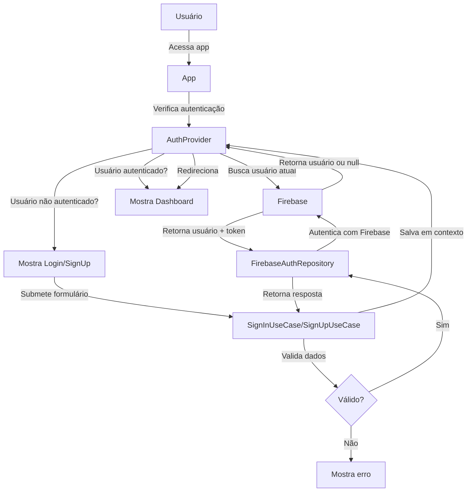

# 🔐 Guia de Configuração - Autenticação com Firebase

## 📋 Visão Geral

Este guia descreve como configurar e usar o sistema de autenticação com Firebase integrado ao ByteBank, seguindo os padrões de **Clean Architecture** e **Arquitetura Modular**.

---

## 🏗️ Arquitetura do Módulo de Autenticação

```
app/modules/auth/
├── core/
│   ├── entities/
│   │   └── User.ts              # Entidades de domínio puro
│   ├── repositories/
│   │   └── IAuthRepository.ts   # Interface do repositório (contrato)
│   └── usecases/
│       ├── SignInUseCase.ts     # Caso de uso: Login
│       ├── SignUpUseCase.ts     # Caso de uso: Cadastro
│       ├── SignOutUseCase.ts    # Caso de uso: Logout
│       └── GetCurrentUserUseCase.ts # Caso de uso: Obter usuário
│
├── infrastructure/
│   └── repositories/
│       └── FirebaseAuthRepository.ts # Implementação com Firebase
│
└── presentation/
    ├── providers/
    │   └── AuthProvider.tsx     # Context/Provider de autenticação
    ├── hooks/
    │   └── useAuth.ts           # Hook para acessar contexto
    └── components/
        ├── LoginForm.tsx        # Componente: Formulário de Login
        ├── SignUpForm.tsx       # Componente: Formulário de Cadastro
        ├── AuthPage.tsx         # Componente: Página de Autenticação
        └── ProtectedRoute.tsx   # Componente: Rota Protegida
```

---

## 🚀 Configuração Inicial

### 1. Instalar Firebase

```bash
npm install firebase
```

> ✅ Firebase já foi instalado automaticamente

### 2. Configurar Credenciais do Firebase

#### Passo 1: Criar Projeto no Firebase

1. Acesse [Firebase Console](https://console.firebase.google.com/)
2. Clique em "Criar Projeto"
3. Siga os passos de criação

#### Passo 2: Ativar Autenticação por Email/Password

1. No projeto, vá para **Autenticação** > **Provedores**
2. Clique em **Email/Password**
3. Habilite **Email/Password** e **Sem senha (Link por email)** (opcional)
4. Clique em **Salvar**

#### Passo 3: Obter Credenciais

1. Vá para **Configurações do Projeto** (ícone de engrenagem)
2. Abra a aba **Apps**
3. Clique em "Web" ou crie uma nova app web
4. Copie as credenciais

#### Passo 4: Adicionar ao `.env.local`

Crie um arquivo `.env.local` na raiz do projeto:

```env
NEXT_PUBLIC_FIREBASE_API_KEY=your_api_key
NEXT_PUBLIC_FIREBASE_AUTH_DOMAIN=your_auth_domain
NEXT_PUBLIC_FIREBASE_PROJECT_ID=your_project_id
NEXT_PUBLIC_FIREBASE_STORAGE_BUCKET=your_storage_bucket
NEXT_PUBLIC_FIREBASE_MESSAGING_SENDER_ID=your_messaging_sender_id
NEXT_PUBLIC_FIREBASE_APP_ID=your_app_id
```

> **Nota:** Use o arquivo `.env.local.example` como referência

---

## 🔑 Usando a Autenticação

### Hook `useAuth()`

O hook `useAuth()` fornece acesso a todas as funcionalidades de autenticação:

```tsx
'use client';

import { useAuth } from '@/app/modules/auth/presentation/hooks/useAuth';

export function MyComponent() {
  const {
    user,              // Usuário autenticado ou null
    token,             // Token JWT
    loading,           // Carregando?
    error,             // Mensagem de erro
    isAuthenticated,   // Está autenticado?
    signIn,            // Função: fazer login
    signUp,            // Função: fazer cadastro
    signOut,           // Função: fazer logout
    clearError,        // Função: limpar erro
  } = useAuth();

  // Seu código aqui
}
```

### Exemplo: Componente de Login

```tsx
'use client';

import { useAuth } from '@/app/modules/auth/presentation/hooks/useAuth';
import { useState } from 'react';

export function LoginComponent() {
  const { signIn, loading, error } = useAuth();
  const [email, setEmail] = useState('');
  const [password, setPassword] = useState('');

  const handleLogin = async (e) => {
    e.preventDefault();
    try {
      await signIn({ email, password });
      // Redirecionár ou fazer algo
    } catch (err) {
      console.error(err);
    }
  };

  return (
    <form onSubmit={handleLogin}>
      <input
        type="email"
        value={email}
        onChange={(e) => setEmail(e.target.value)}
        placeholder="Email"
      />
      <input
        type="password"
        value={password}
        onChange={(e) => setPassword(e.target.value)}
        placeholder="Senha"
      />
      <button type="submit" disabled={loading}>
        {loading ? 'Entrando...' : 'Login'}
      </button>
      {error && <p>{error}</p>}
    </form>
  );
}
```

### Exemplo: Componente de Cadastro

```tsx
'use client';

import { useAuth } from '@/app/modules/auth/presentation/hooks/useAuth';
import { useState } from 'react';

export function SignUpComponent() {
  const { signUp, loading, error } = useAuth();
  const [formData, setFormData] = useState({
    email: '',
    password: '',
    displayName: '',
  });

  const handleSignUp = async (e) => {
    e.preventDefault();
    try {
      await signUp(formData);
      // Sucesso!
    } catch (err) {
      console.error(err);
    }
  };

  return (
    <form onSubmit={handleSignUp}>
      <input
        type="text"
        value={formData.displayName}
        onChange={(e) =>
          setFormData({ ...formData, displayName: e.target.value })
        }
        placeholder="Nome"
      />
      <input
        type="email"
        value={formData.email}
        onChange={(e) =>
          setFormData({ ...formData, email: e.target.value })
        }
        placeholder="Email"
      />
      <input
        type="password"
        value={formData.password}
        onChange={(e) =>
          setFormData({ ...formData, password: e.target.value })
        }
        placeholder="Senha"
      />
      <button type="submit" disabled={loading}>
        {loading ? 'Cadastrando...' : 'Cadastrar'}
      </button>
      {error && <p>{error}</p>}
    </form>
  );
}
```

### Exemplo: Proteger Rotas

```tsx
'use client';

import { ProtectedRoute } from '@/app/modules/auth/presentation/components/ProtectedRoute';
import { AuthPage } from '@/app/modules/auth/presentation/components/AuthPage';

export default function Dashboard() {
  return (
    <ProtectedRoute fallback={<AuthPage />}>
      {/* Conteúdo protegido */}
      <h1>Bem-vindo ao Dashboard!</h1>
    </ProtectedRoute>
  );
}
```

---

## 🔄 Fluxo de Autenticação



---

## 📚 Estrutura de Dados

### Entidade User

```typescript
interface User {
  id: string;                    // UID do Firebase
  email: string;                 // Email do usuário
  displayName: string | null;    // Nome de exibição
  photoURL: string | null;       // URL da foto de perfil
  emailVerified: boolean;        // Email verificado?
  createdAt: Date;              // Data de criação
  updatedAt: Date;              // Última atualização
}
```

### AuthCredentials (Login)

```typescript
interface AuthCredentials {
  email: string;
  password: string;
}
```

### SignUpData (Cadastro)

```typescript
interface SignUpData extends AuthCredentials {
  displayName: string;
}
```

### AuthResponse

```typescript
interface AuthResponse {
  user: User;          // Usuário autenticado
  token: string;       // Token JWT
}
```

---

## 🧪 Casos de Uso

### SignInUseCase

**Responsabilidade:** Validar credenciais e fazer login

```typescript
const signInUseCase = new SignInUseCase(authRepository);
const response = await signInUseCase.execute({
  email: 'user@example.com',
  password: 'password123',
});
```

**Validações:**
- Email e password obrigatórios
- Email deve ser válido
- Senha será validada pelo Firebase

### SignUpUseCase

**Responsabilidade:** Validar dados e registrar novo usuário

```typescript
const signUpUseCase = new SignUpUseCase(authRepository);
const response = await signUpUseCase.execute({
  email: 'user@example.com',
  password: 'password123',
  displayName: 'João Silva',
});
```

**Validações:**
- Email, password e displayName obrigatórios
- Email deve ser válido
- Senha mínimo 6 caracteres
- Email não pode estar em uso

### SignOutUseCase

**Responsabilidade:** Fazer logout do usuário

```typescript
const signOutUseCase = new SignOutUseCase(authRepository);
await signOutUseCase.execute();
```

### GetCurrentUserUseCase

**Responsabilidade:** Obter usuário atualmente autenticado

```typescript
const getCurrentUserUseCase = new GetCurrentUserUseCase(authRepository);
const user = await getCurrentUserUseCase.execute();
```

---

## 🔐 Tratamento de Erros

Todos os erros do Firebase são mapeados para mensagens em português:

| Código Firebase | Mensagem |
|---|---|
| `auth/user-not-found` | Usuário não encontrado |
| `auth/wrong-password` | Senha incorreta |
| `auth/email-already-in-use` | Email já está em uso |
| `auth/weak-password` | Senha muito fraca |
| `auth/invalid-email` | Email inválido |
| `auth/operation-not-allowed` | Operação não permitida |
| `auth/too-many-requests` | Muitas tentativas. Tente mais tarde. |

---

## 💾 Persistência

- **Token JWT:** Salvo em `localStorage` com chave `authToken`
- **Sessão:** Mantida enquanto a aba está aberta
- **Refresh automático:** Token é renovado automaticamente pelo Firebase

---

## 🎯 Próximos Passos (Opcional)

1. **Adicionar verificação de email:** `sendEmailVerification()`
2. **Reset de senha:** Implementar `resetPassword()`
3. **Login com provedores:** Google, GitHub, etc.
4. **Autenticação multi-fator:** MFA/2FA
5. **Perfis de usuário:** Estender dados do usuário

---

## 📝 Checklist

- [ ] Criar projeto Firebase
- [ ] Ativar Email/Password na autenticação
- [ ] Copiar credenciais do Firebase
- [ ] Criar arquivo `.env.local`
- [ ] Adicionar credenciais ao `.env.local`
- [ ] Testar login
- [ ] Testar cadastro
- [ ] Testar logout
- [ ] Verificar proteção de rotas

---

## ❓ Dúvidas Frequentes

### P: Como alterar a senha do usuário?
R: Use `updatePassword()` do Firebase Authentication. Você pode implementar um caso de uso adicional se necessário.

### P: Como fazer login com Google?
R: Importe `signInWithPopup` e `GoogleAuthProvider` do Firebase e crie um novo caso de uso.

### P: Onde armazeno dados adicionais do usuário?
R: Use Firebase Firestore para criar uma coleção `users` com dados complementares. Você pode estender `FirebaseAuthRepository` para isso.

### P: Como funciona o token JWT?
R: Firebase emite um token JWT automaticamente após autenticação. Ele é renovado automaticamente e pode ser enviado em requisições à API.

### P: Posso usar isso em componentes Server?
R: Não, use apenas em componentes Client (`'use client'`). O contexto de autenticação requer React Context.

---

## 🚀 Suporte

Para mais informações sobre Firebase Authentication:
- [Documentação Firebase](https://firebase.google.com/docs/auth)
- [Next.js com Firebase](https://firebase.google.com/docs/web/setup)
